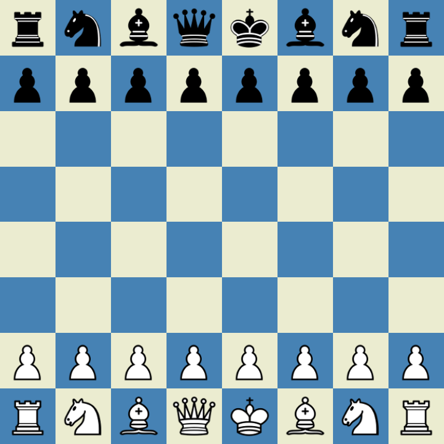

# [Chess](https://eeoooue.github.io/Chess/)

A plain implementation of Chess in TypeScript, based on the [chess.com](http://chess.com) UI, using [Cburnett's chess pieces](https://commons.wikimedia.org/wiki/Category:SVG_chess_pieces).

